*   [Overview](#DeployVeleroinSupervisorClusterwithImagesfromPrivateRegistry-Overview)
*   [Manifest](#DeployVeleroinSupervisorClusterwithImagesfromPrivateRegistry-Manifest)
*   [Deploy Velero Operator](#DeployVeleroinSupervisorClusterwithImagesfromPrivateRegistry-DeployVeleroOperator)
    *   [Add Velero vSphere Operator as a vSphere Service](#DeployVeleroinSupervisorClusterwithImagesfromPrivateRegistry-AddVelerovSphereOperatorasavSphereService)
    *   [Install Velero vSphere Operator on Supervisor Cluster(s)](#DeployVeleroinSupervisorClusterwithImagesfromPrivateRegistry-InstallVelerovSphereOperatoronSupervisorCluster(s))
    *   [Successful Deployment of Velero vSphere Operator](#DeployVeleroinSupervisorClusterwithImagesfromPrivateRegistry-SuccessfulDeploymentofVelerovSphereOperator)
*   [Deploy Velero Instance](#DeployVeleroinSupervisorClusterwithImagesfromPrivateRegistry-DeployVeleroInstance)
*   [Deploy Data Manager VM](#DeployVeleroinSupervisorClusterwithImagesfromPrivateRegistry-DeployDataManagerVM)
    *   [Create a Supervisor Namespace for Velero](#DeployVeleroinSupervisorClusterwithImagesfromPrivateRegistry-CreateaSupervisorNamespaceforVelero)
    *   [Configure Permission for Supervisor DevOps](#DeployVeleroinSupervisorClusterwithImagesfromPrivateRegistry-ConfigurePermissionforSupervisorDevOps)
    *   [Deploy Velero and Plugins](#DeployVeleroinSupervisorClusterwithImagesfromPrivateRegistry-DeployVeleroandPlugins)
        *   [Images From the Same Private Registry](#DeployVeleroinSupervisorClusterwithImagesfromPrivateRegistry-ImagesFromtheSamePrivateRegistry)
        *   [Images From Any Public Registry](#DeployVeleroinSupervisorClusterwithImagesfromPrivateRegistry-ImagesFromAnyPublicRegistry)
    *   [Successful Deployment of Velero](#DeployVeleroinSupervisorClusterwithImagesfromPrivateRegistry-SuccessfulDeploymentofVelero)
        *   [vSphere UI](#DeployVeleroinSupervisorClusterwithImagesfromPrivateRegistry-vSphereUI)
        *   [Kubectl CLI](#DeployVeleroinSupervisorClusterwithImagesfromPrivateRegistry-KubectlCLI)
*   [Reference](#DeployVeleroinSupervisorClusterwithImagesfromPrivateRegistry-Reference)

Overview
========

In Air-gapped environment, users usually would like to deploy application from private registry which is protected by registry credential. To meet this requirement, we support deploying Velero in Supervisor Cluster with images from private registry.

Manifest
========

*   Velero vSphere operator YAML: [https://vmwaresaas.jfrog.io/ui/api/v1/download?repoKey=Velero-YAML&path=Velero%252FSupervisorService%252F1.0.0%252Fvelero-supervisorservice-1.0.0.yaml](https://vmwaresaas.jfrog.io/ui/api/v1/download?repoKey=Velero-YAML&path=Velero%252FSupervisorService%252F1.0.0%252Fvelero-supervisorservice-1.0.0.yaml)

Note: The following screenshots show the installation using Velero vSphere Operator 1.0.0. If you want to install using the latest Velero vSphere Operator version, refer to this [page](https://github.com/vsphere-tmm/Supervisor-Services/blob/main/README.md#velero-versions).

Deploy Velero Operator
======================

Add Velero vSphere Operator as a vSphere Service
------------------------------------------------

Navigate to Workload Management Services page. Click the botton in red box below to add a new service in vSphere Services. (It can be done by corresponding DCLI command as well)

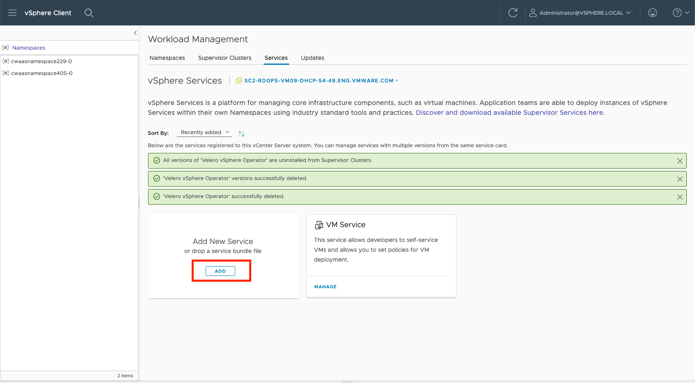

  

Upload the Velero vSphere operator YAML mentioned in **Manifest** section above.

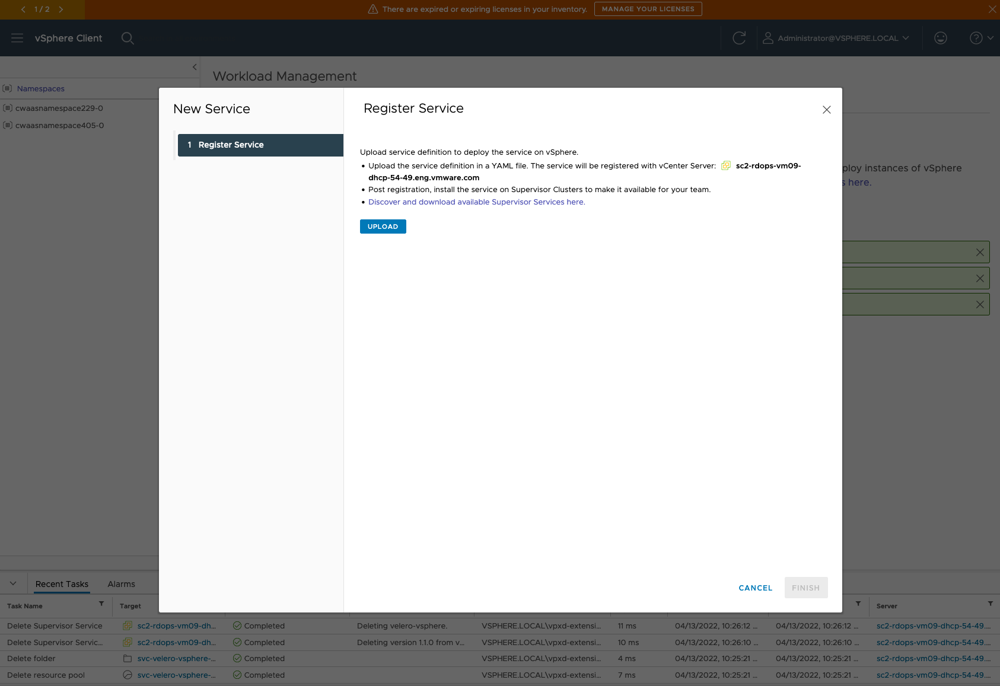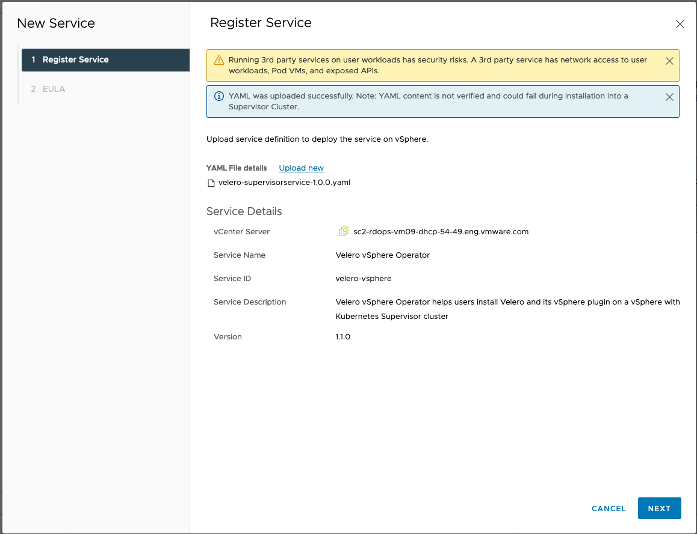

  

Install Velero vSphere Operator on Supervisor Cluster(s)
--------------------------------------------------------

Select "Install on Supervisors" as below to install the newly added vSphere Service, Velero vSphere Operator, on Supervisor Cluster(s).

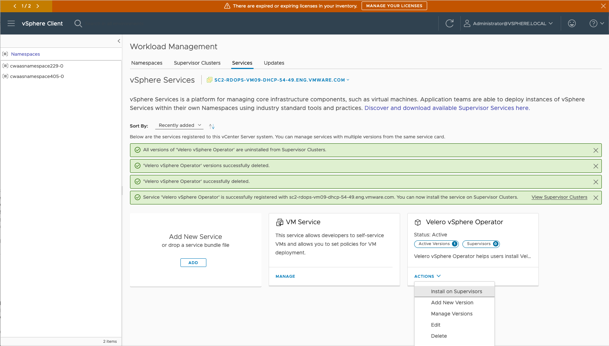

  

Provide configuration parameters for install Velero vSphere Operator on Supervisor Clusters.

**Note**: To deploy velero operator with images from private registry, both **registryUsername** and **registryPasswd** are required. Please make sure Velero vSphere Operator image with **Select Version** is available in the registry as specified in the **registryName** field.

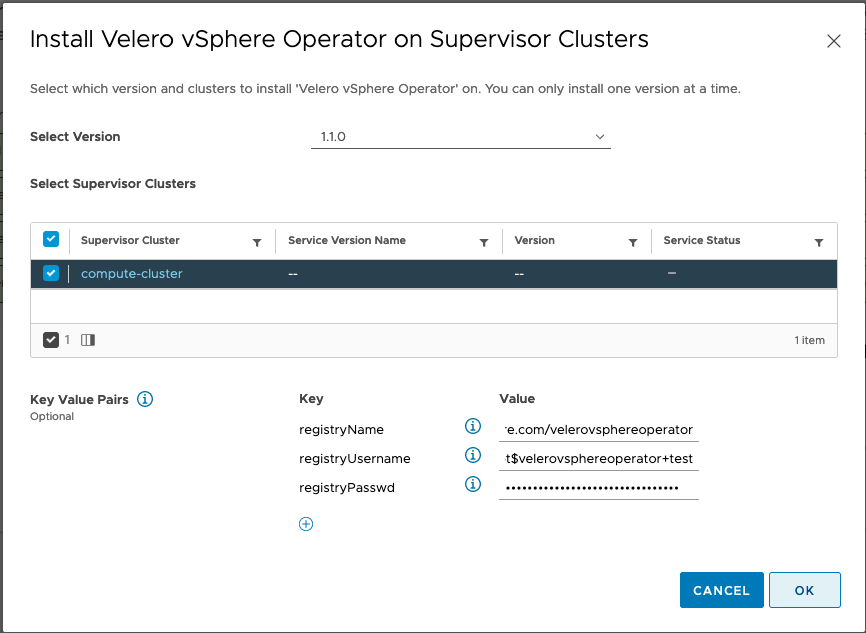

The above screenshot shows how add Key Value Pairs of the registry while installing Velero vSphere Operator on Supervisor Cluster as in vCenter 7. 

In VC 8.0, the option will not show as Key Value Pairs as VC 7.0. Customers can provide those options by entering them in "YAML Service Config", see the following example.

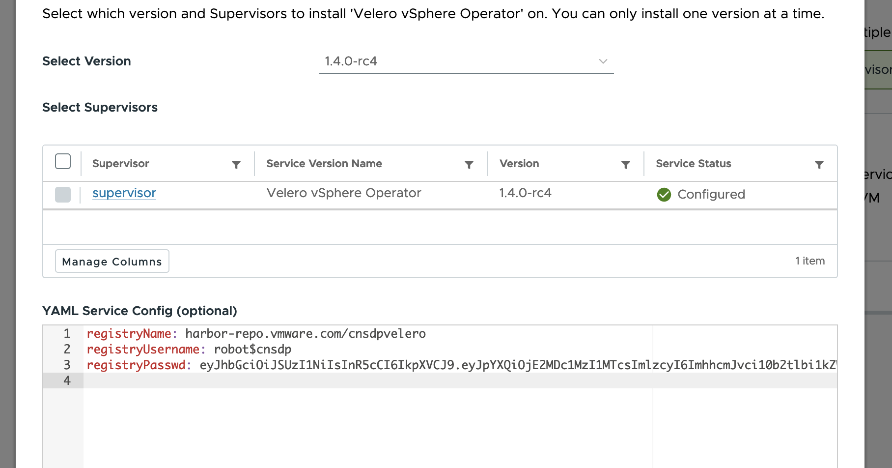

Successful Deployment of Velero vSphere Operator
------------------------------------------------

After Velero vSphere Operator is installed in Supervisor Cluster, we can see that a new vSphere Service instance for Velero vSphere Operator is added to Supervisor Cluster and its Service Status is in the **Configured** state.

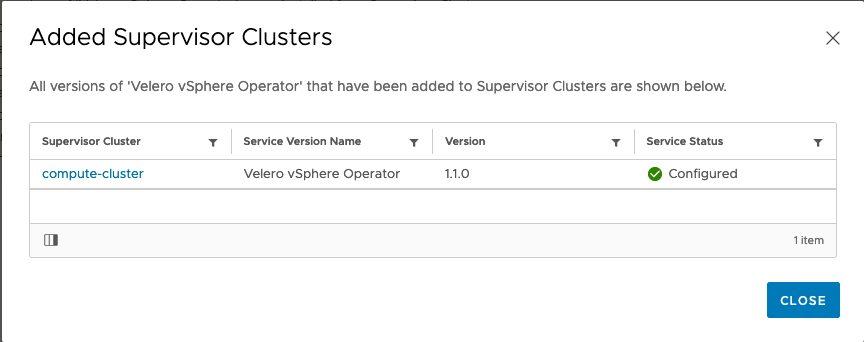

  

Meanwhile, we can see Velero vSphere operator is in **Running** status in its own Supervisor namespace (svc-velero-vsphere-domain-c8 in this case).

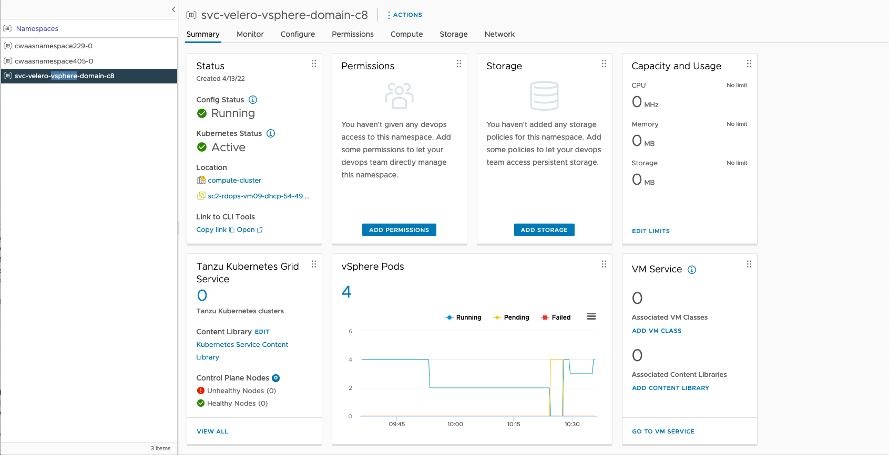

That's it for deploying Velero vSphere Operator in Supervisor Cluster with image from private registry.

Deploy Velero Instance
======================

Deploy Data Manager VM
======================

Please refer to [https://github.com/vmware-tanzu/velero-plugin-for-vsphere/blob/main/docs/supervisor-datamgr.md](https://github.com/vmware-tanzu/velero-plugin-for-vsphere/blob/main/docs/supervisor-datamgr.md).

Create a Supervisor Namespace for Velero
----------------------------------------


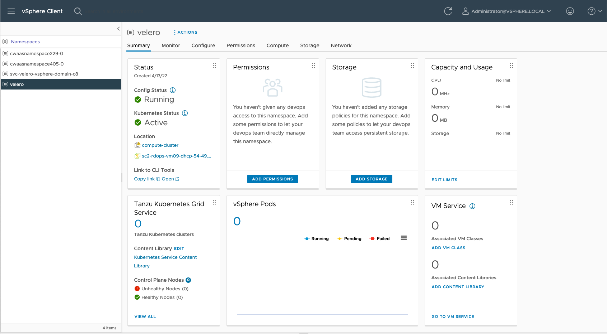

Configure Permission for Supervisor DevOps
------------------------------------------

Supervisor DevOps will need EDIT permission to deploy Velero in the Supervisor Namespace. It is **optional** for vSphere Admin.

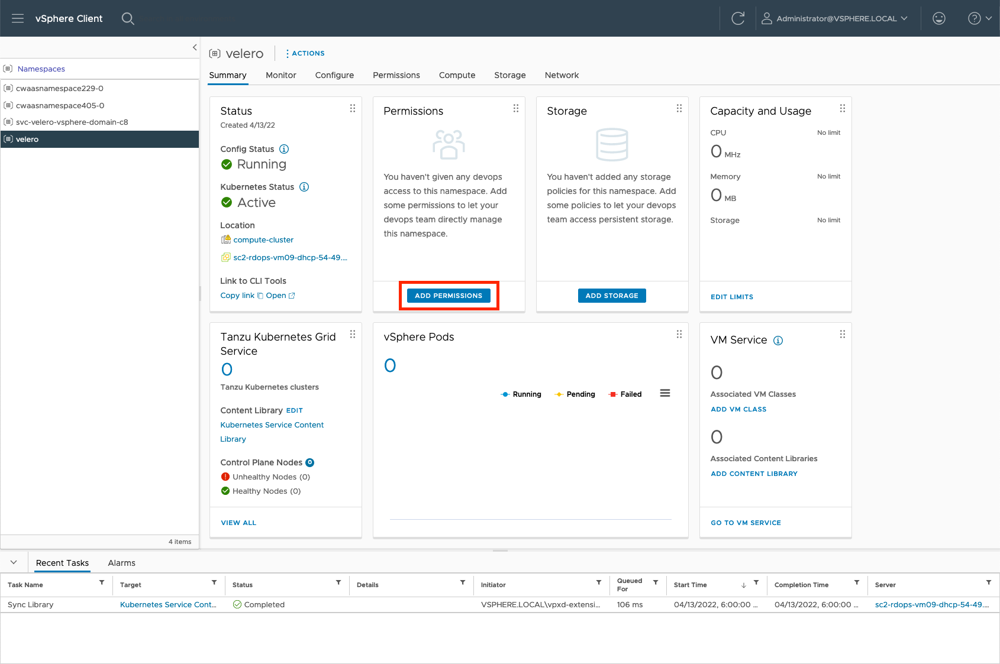

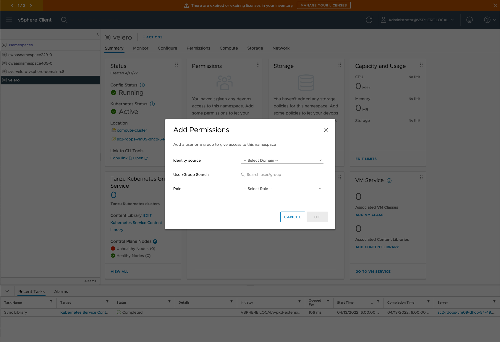

Deploy Velero and Plugins
-------------------------

It is supported to deploy Velero and plugins with images in the following two cases.

### Images From the Same Private Registry

**Note**: To deploy Velero with images from private registry as well, it would only work for images from the same private registry whose credential has been provided while enable Velero vSphere Operator in Supervisor Cluster. Also, the **\--use-private-registry** option in the install command is required.

Below is an example of velero-vsphere install command.

```bash
BUCKET=velero-v1.5.1-backups
REGION=minio
NAMESPACE=velero
S3URL=http://csm-minio.eng.vmware.com

VSPHERE_PLUGIN_IMAGE=harbor-stg-repo.vmware.com/velerovsphereoperator/velero-plugin-for-vsphere:v1.3.1
AWS_PLUGIN_IMAGE=harbor-stg-repo.vmware.com/velerovsphereoperator/velero-plugin-for-aws:v1.1.0
VELERO_IMAGE=harbor-stg-repo.vmware.com/velerovsphereoperator/velero:v1.5.1

# install velero in air-gapped environment
velero-vsphere install \
    --namespace $NAMESPACE \
    --image $VELERO_IMAGE \
    --provider aws \
    --plugins $AWS_PLUGIN_IMAGE,$VSPHERE_PLUGIN_IMAGE \
    --bucket $BUCKET \
    --secret-file ~/.minio/credentials \
    --snapshot-location-config region=$REGION \
    --backup-location-config region=$REGION,s3ForcePathStyle="true",s3Url=$S3URL \
    --use-private-registry                          # <====== Key Option to deploy Velero with images from private registry
```

  

Instead, the following two cases would end up with **ImagePullBackOff** error below.

*   Deploying velero with images from a different private registry.
*   Deploying velero with images from the same private registry, but without using the **\--use-private-registry** option in the install command above.

```bash
0s          Warning   Failed                           pod/backup-driver-5c585967c9-dbm76                                          Failed to pull image "harbor-stg-repo.vmware.com/velerovsphereoperator/backup-driver:v1.3.1": rpc error: code = Unknown desc = failed to pull and unpack image "harbor-stg-repo.vmware.com/velerovsphereoperator/backup-driver:v1.3.1": failed to resolve reference "harbor-stg-repo.vmware.com/velerovsphereoperator/backup-driver:v1.3.1": unexpected status code [manifests v1.3.1]: 401 Unauthorized
```

### Images From Any Public Registry

Alternatively, it is also OK to deploy velero instance with images from any other public registry, even if the Velero vSphere Operator is deployed with images from a private registry.

Below is an example of velero-vsphere install command.

```bash
BUCKET=velero-v1.5.1-backups
REGION=minio
NAMESPACE=velero
S3URL=http://csm-minio.eng.vmware.com

VSPHERE_PLUGIN_IMAGE=harbor-repo.vmware.com/velero/velero-plugin-for-vsphere:v1.3.1
AWS_PLUGIN_IMAGE=harbor-repo.vmware.com/velero/velero-plugin-for-aws:v1.1.0
VELERO_IMAGE=harbor-repo.vmware.com/velero/velero:v1.5.1

# install velero in air-gapped environment
velero-vsphere install \
    --namespace $NAMESPACE \
    --image $VELERO_IMAGE \
    --provider aws \
    --plugins $AWS_PLUGIN_IMAGE,$VSPHERE_PLUGIN_IMAGE \
    --bucket $BUCKET \
    --secret-file ~/.minio/credentials \
    --snapshot-location-config region=$REGION \
    --backup-location-config region=$REGION,s3ForcePathStyle="true",s3Url=$S3URL
```

  

Successful Deployment of Velero
-------------------------------

Below are observations from both vSphere UI and CLI when Velero and plugins are deployed on Supervisor Cluster sucessfully.

### vSphere UI

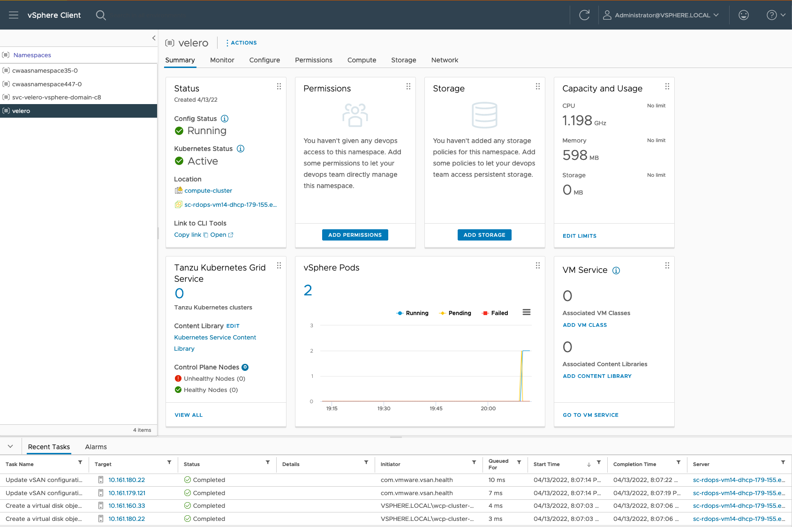

### Kubectl CLI

```bash
$ kubectl -n velero get all
NAME                                READY   STATUS    RESTARTS   AGE
pod/backup-driver-cb4d96d57-glxfz   1/1     Running   0          4m30s
pod/velero-744cfc7ccc-gn6cn         1/1     Running   0          4m47s

NAME                            READY   UP-TO-DATE   AVAILABLE   AGE
deployment.apps/backup-driver   1/1     1            1           4m30s
deployment.apps/velero          1/1     1            1           4m48s

NAME                                      DESIRED   CURRENT   READY   AGE
replicaset.apps/backup-driver-cb4d96d57   1         1         1       4m30s
replicaset.apps/velero-744cfc7ccc         1         1         1       4m48s
```
  