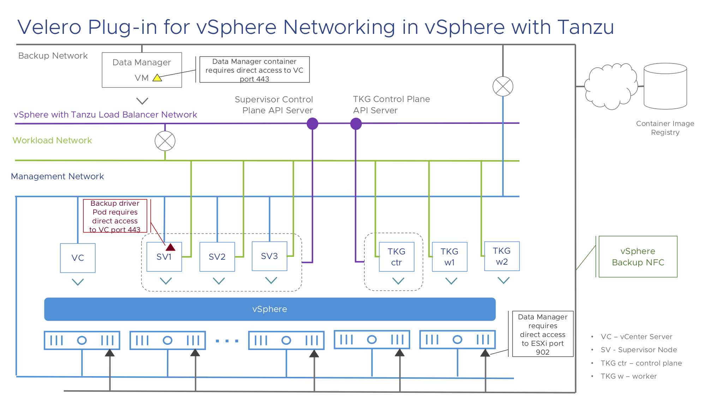

# vSphere with Tanzu notes

## Networking Considerations

The networking considerations have already been mentioned in the [README.md](velero-plugin-for-vsphere/repo/blob/main/README.md).

**vSphere with Tanzu** supports two distinct networking deployments with the release of vSphere 7.0 Update 1 (U1). The first deployment leverages ```NSX-T``` to provide load balancing services as well as overlay networking for Pod VM to Pod VM communication in the Supervisor Cluster. The second networking configuration supported by vSphere with Tanzu uses native vSphere network distributed switches and a ```HA Proxy``` to provide load balancing services. Native vSphere networking does not provide any overlay networking capabilities, and thus this deployment does not currently support Pod VMs in the Supervisor. Since Pod VMs are a requirement when wish to use the **Velero Plugin for vSphere** in vSphere with Tanzu, it currently requires a networking deployment that uses NSX-T. vSphere with Tanzu deployments that use native vSphere distributed switch networking and the HA Proxy for load balancing cannot currently be backed up using the Velero Plugin for vSphere.

```TKGS``` is the Tanzu Kubernetes Grid Service, a service available in vSphere with Tanzu to enable the deployment of TKG (guest) clusters in vSphere with Tanzu namespaces. Whilst TKGS is available in both deployments types of vSphere with Tanzu (NSX-T and native vSphere networking), the ability to backup TKGS guest clusters also requires the Supervisor Cluster to have the Velero Plugin for vSphere to be installed in the Supervisor Cluster. Since this is not possible with vSphere with Tanzu which uses native vSphere distributed switch networking, the Velero Plugin for vSphere is currently unable to backup and restore TKG guest clustes in these deployments.

Below is the networking diagram of velero-plugin-for-vsphere in vSphere with Tanzu cluster.



## Restricted resources

Certain resources with the **vSphere with Tanzu** Supervisor Cluster need to be created by the Supervisor Cluster and cannot be restored. The **Velero Plugin for vSphere** blocks backup and restore of these resources and will generate errors if an attempt is made to backup or restore these resources and the backup or restore will be marked as "Partially Failed".

A configmap named `velero-vsphere-plugin-blocked-resources-list` will be created in the namespace where you install velero during **Velero Plugin for vSphere** installation. Exclude the resources in the configmap from your backups to avoid these errors. After the plugin is deployed, users can edit the configmap to remove resources from being blocked, or add more resources to be blocked. Users should not delete the configmap.

**Note**: The configmap `velero-vsphere-plugin-blocked-resources-list` will be reset to the default list only when user try to reboot velero pod.

The default list of blocked resources in configmap is:

### vSphere with Tanzu Supervisor Cluster resources

 	agentinstalls.installers.tmc.cloud.vmware.com
 	availabilityzones.topology.tanzu.vmware.com
 	aviloadbalancerconfigs.netoperator.vmware.com
 	blockaffinities.crd.projectcalico.org
 	ccsplugins.appplatform.wcp.vmware.com
 	certificaterequests.cert-manager.io
 	certificates.cert-manager.io
 	challenges.acme.cert-manager.io
 	clusterissuers.cert-manager.io
 	clusternetworkinfos.nsx.vmware.com
 	clusterresourcesetbindings.addons.cluster.x-k8s.io
 	clusterresourcesets.addons.cluster.x-k8s.io
 	clusters.cluster.x-k8s.io
 	cnscsisvfeaturestates.cns.vmware.com
 	cnsfileaccessconfigs.cns.vmware.com
 	cnsfilevolumeclients.cns.vmware.com
 	cnsnodevmattachments.cns.vmware.com
 	cnsregistervolumes.cns.vmware.com
 	cnsvolumemetadatas.cns.vmware.com
 	compatibilities.run.tanzu.vmware.com
 	contentlibraryproviders.vmoperator.vmware.com
 	contentsources.vmoperator.vmware.com
 	drainrequests.psp.wcp.vmware.com
 	gatewayclasses.networking.x-k8s.io
 	gateways.networking.x-k8s.io
 	haproxyloadbalancerconfigs.netoperator.vmware.com
 	httproutes.networking.x-k8s.io
 	imagedisks.imagecontroller.vmware.com
 	installoptions.appplatform.wcp.vmware.com
 	installrequirements.appplatform.wcp.vmware.com
 	ipamblocks.crd.projectcalico.org
 	ipamconfigs.crd.projectcalico.org
 	ipamhandles.crd.projectcalico.org
 	ippools.crd.projectcalico.org
 	ippools.netoperator.vmware.com
 	ippools.nsx.vmware.com
 	issuers.cert-manager.io
 	kubeadmconfigs.bootstrap.cluster.x-k8s.io
 	kubeadmconfigtemplates.bootstrap.cluster.x-k8s.io
 	kubeadmcontrolplanes.controlplane.cluster.x-k8s.io
 	kuberneteslicenses.licenseoperator.vmware.com
 	loadbalancerconfigs.netoperator.vmware.com
 	loadbalancers.vmware.com
 	machinedeployments.cluster.x-k8s.io
 	machinehealthchecks.cluster.x-k8s.io
 	machinepools.exp.cluster.x-k8s.io
 	machines.cluster.x-k8s.io
 	machinesets.cluster.x-k8s.io
 	members.registryagent.vmware.com
 	namespacenetworkinfos.nsx.vmware.com
 	ncpconfigs.nsx.vmware.com
 	networkinterfaces.netoperator.vmware.com
 	networks.netoperator.vmware.com
 	nsxerrors.nsx.vmware.com
 	nsxlocks.nsx.vmware.com
 	nsxnetworkconfigurations.nsx.vmware.com
 	nsxnetworkinterfaces.nsx.vmware.com
 	orders.acme.cert-manager.io
 	persistenceinstanceinfoes.psp.wcp.vmware.com
 	persistenceserviceconfigurations.psp.wcp.vmware.com
 	projects.registryagent.vmware.com
 	providerserviceaccounts.run.tanzu.vmware.com
 	psprecencyrequests.psp.wcp.vmware.com
 	pvcdisruptionbudgets.psp.wcp.vmware.com
 	registries.registryagent.vmware.com
 	resourcecheckreports.psp.wcp.vmware.com
 	resourcechecks.psp.wcp.vmware.com
 	routesets.nsx.vmware.com
 	statefuldrainnodes.psp.wcp.vmware.com
 	statefulreadynodes.psp.wcp.vmware.com
 	storagepolicies.appplatform.wcp.vmware.com
 	storagepolicies.psp.wcp.vmware.com
 	storagepools.cns.vmware.com
 	supervisorservices.appplatform.wcp.vmware.com
 	tanzukubernetesaddons.run.tanzu.vmware.com
 	tanzukubernetesclusters.run.tanzu.vmware.com
 	tanzukubernetesreleases.run.tanzu.vmware.com
 	tcproutes.networking.x-k8s.io
 	tkgserviceconfigurations.run.tanzu.vmware.com
 	vcuiplugins.appplatform.wcp.vmware.com
 	veleroservices.veleroappoperator.vmware.com
 	virtualmachineclassbindings.vmoperator.vmware.com
 	virtualmachineclasses.vmoperator.vmware.com
 	virtualmachineimages.vmoperator.vmware.com
 	virtualmachines.vmoperator.vmware.com
 	virtualmachineservices.vmoperator.vmware.com
 	virtualmachinesetresourcepolicies.vmoperator.vmware.com
 	virtualnetworkinterfaces.vmware.com
 	virtualnetworks.vmware.com
 	vmxnet3networkinterfaces.netoperator.vmware.com
 	vspheredistributednetworks.netoperator.vmware.com
 	wcpclusters.infrastructure.cluster.vmware.com
 	wcpmachines.infrastructure.cluster.vmware.com
 	wcpmachinetemplates.infrastructure.cluster.vmware.com
 	wcpnamespaces.appplatform.wcp.vmware.com
 	webconsolerequests.vmoperator.vmware.com

For example, the backup of a Supervisor ```namespace``` with **Tanzu Kubernetes Grid Service** will fail since it contains some of restricted resources listed above.

## Supervisor Cluster resources handled during restore

The following resources are handled during the restore on the Supervisor Cluster.
  * `images.imagecontroller.vmware.com`
    The image resource is backed up everytime a container is backed up on the Supervisor Cluster. It will be skipped at restore time.
  * `pods`
    We need to remove some metadata from the Pod resource on the Supervisor Cluster, i.e. annotation ```vmware-system-vm-uuid``` before the restore as the existing VM UUID is associated with the old VM that does not exist any more. The following annotations will be removed from the Pod resource on the Supervisor Cluster.
    * kubernetes.io/psp
    * mac
    * vlan
    * vmware-system-ephemeral-disk-uuid
    * vmware-system-image-references
    * vmware-system-vm-moid
    * vmware-system-vm-uuid

## vSphere Plugin resources

The **Velero Plug-in for vSphere** also has internal resources. These are automatically tagged with the Velero velero.io/exclude-from-backup label and will not be part of backups. Additionally, the plugin will block these as well. If you see errors related to these resource, the ```exclude-from-backup``` label has probably been removed from them.

    backuprepositories.backupdriver.cnsdp.vmware.com     
    backuprepositoryclaims.backupdriver.cnsdp.vmware.com 
    clonefromsnapshots.backupdriver.cnsdp.vmware.com     
    deletesnapshots.backupdriver.cnsdp.vmware.com        
    downloads.datamover.cnsdp.vmware.com              
    snapshots.backupdriver.cnsdp.vmware.com              
    uploads.datamover.cnsdp.vmware.com         
