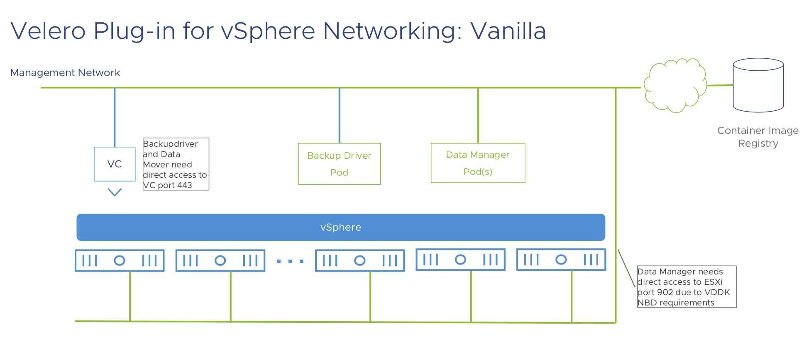

# Velero Plugin for vSphere in Vanilla Kubernetes Cluster

## Table of Contents

1. [Compatibility](#compatibility)
2. [Prerequisites](#prerequisites)
3. [Install](#install)
4. [Upgrade](#upgrade)
5. [Uninstall](#uninstall)
6. [Backup](#backup)
7. [Restore](#restore)

## Compatibility

| Velero Plugin for vSphere Version | vSphere Version        | Kubernetes Version | vSphere CSI Driver Version | Velero Version | Deprecated | EOL Date      |
|-----------------------------------|------------------------|--------------------|----------------------------|----------------|------------|---------------|
| 1.3.1                             | 6.7U3 P06 - 7.0U3      | 1.19-1.22          | 2.2.2, 2.3.1, 2.4.1        | 1.7.0          | No         | N/A           |
| 1.3.0                             | 6.7U3 P06 - 7.0U3      | 1.19-1.22          | 2.2.2, 2.3.1, 2.4.1        | 1.7.0          | Yes        | December 2022 |
| 1.2.1                             | 6.7U3 P06 - 7.0U2      | 1.19-1.21          | 2.1.2, 2.2.2, 2.3.1        | 1.5.1          | Yes        | June 2023     |
| 1.2.0                             | 6.7U3 P06 - 7.0U2      | 1.19-1.21          | 2.1.2, 2.2.2, 2.3.1        | 1.5.1          | Yes        | December 2022 |
| 1.1.1                             | 6.7U3 P06 - 7.0U1c/P02 | 1.17-1.19          | 2.0.1, 2.1.0               | 1.5.1          | No         | N/A           |
| 1.1.0                             | 6.7U3 P06 - 7.0U1c/P02 | 1.17-1.21          | 2.0.1, 2.1.0               | 1.5.1          | Yes        | December 2022 |

**Note**: Velero Plugin for vSphere 1.0.2 and earlier: EOL.
**Note**: Velero Plugin for vSphere 1.2.x does not work for TKGm which is fixed in 1.3.0+.
**Note**: Velero Plugin for vSphere does not support vSphere CSI Driver deployed as a process with multiple replicas in a Kubernetes multi-node control plane setup.

## Prerequisites

* Meet the prerequisites of vSphere CSI driver on vSphere roles and privileges - please refer to
[vSphere Roles and Privileges](https://vsphere-csi-driver.sigs.k8s.io/driver-deployment/prerequisites.html#roles_and_privileges)
of vSphere CSI Driver.
* Meet the prerequisites of Virtual Disk Development Kit (VDDK).
  * Please refer to [Credentials and Privileges for VMDK Access](https://code.vmware.com/docs/11750/virtual-disk-development-kit-programming-guide/GUID-8301C6CF-37C2-42CC-B4C5-BB1DD28F79C9.html)
of VDDK Programming Guide. **Note: please apply privileges at the vCenter Server level**.
  * Please make sure to open port **902** on any ESXi that hosts Kubernetes node VMs. This port requirement is specific to the NBD transport mode of VDDK. Below is an example of networking setup in Vanilla cluster on vSphere.
    

## Install

1. [Install Velero](https://velero.io/docs/v1.5/basic-install/)
2. [Install Object Storage Plugin](#install-object-storage-plugin)
3. [Create VC Credential Secret](#create-vc-credential-secret)
4. [Create Velero vSphere Plugin Config](#create-velero-vsphere-plugin-config)
5. [Install Velero vSphere Plugin](#install-velero-vsphere-plugin)

### Install Object Storage Plugin

Volume backups are stored in an object store bucket. They are stored in the same bucket configured for the object storage plugin of Velero. Before installing the vSphere plugin, a Velero object storage plugin is required.

Currently, only AWS plugin is supported and compatible with vSphere plugin. Please refer to [velero-plugin-for-aws](https://github.com/vmware-tanzu/velero-plugin-for-aws/blob/master/README.md) for more details about using **AWS S3** as the object store for backups. S3-compatible object stores, e.g, **MinIO**, are also supported via AWS plugin. Please refer to [install with MinIO](https://velero.io/docs/v1.5/contributions/minio/).

### Create VC Credential Secret

You can retrieve these values from Secret `vsphere-config-secret` in `vmware-system-csi` namespace for
2.3 and later vSphere CSI driver OR Secret `vsphere-config-secret` in `kube-system` namespace for 2.2 or earlier vSphere
CSI driver. In other cases these values can be obtained from vSphere Admin.


```bash
% cat csi-vsphere.conf
[Global]
cluster-id = "cluster1"

[VirtualCenter "10.182.1.133"]
user = "user@vsphere.local"
password = "password"
port = "443"

% kubectl -n <velero-namespace> create secret generic velero-vsphere-config-secret --from-file=csi-vsphere.conf
```

### Create Velero vSphere Plugin Config

The config map provides information about the cluster flavor and VC Credential Secret created in the previous step during
install.

```bash
% cat <<EOF | kubectl -n <velero-namespace> apply -f -
apiVersion: v1
kind: ConfigMap
metadata:
  name: velero-vsphere-plugin-config
data:
  cluster_flavor: VANILLA
  vsphere_secret_name: velero-vsphere-config-secret
  vsphere_secret_namespace: velero
EOF
```

### Install Velero vSphere Plugin

```bash
velero plugin add <plugin-image>
```

For Version 1.3.0 the command is

```bash
velero plugin add vsphereveleroplugin/velero-plugin-for-vsphere:v1.3.0
```

Please refer to [velero-plugin-for-vsphere tags](https://github.com/vmware-tanzu/velero-plugin-for-vsphere/tags) for correct tags for versions 1.3.0 and higher.

#### Install in Air-gapped environment

If it is an air-gapped environment, please refer to [Install Notes with Customized Images](install-notes.md) for extra required steps.

#### Install with self-signed certificate

To use velero-plugin-for-vsphere with a storage provider secured by a self-signed certificate, please refer to [velero-plugin-for-vsphere with a storage provider secured by a self-signed certificate](self-signed-certificate.md).

## Upgrade

An alternate to upgrading would be to [Uninstall](#uninstall) and do a fresh [Install](#install)

1. [Scale down Velero and plugin components](#scale-down-velero-and-plugin-components)
2. [Create vSphere Credentials Secret](#create-vsphere-credentials-secret)
3. [Create Velero vSphere Plugin Configuration](#create-velero-vsphere-plugin-configuration)
4. [Update the plugin image](#update-the-plugin-image)
5. [Scale up velero deployment](#scale-up-velero-deployment)

#### Scale down Velero and plugin components

The following command scales down the `velero` deployment and deletes `backup-driver` and `datamgr-for-vsphere-plugin`

```bash
kubectl -n <velero-namespace> delete deploy/backup-driver
kubectl -n <velero-namespace> delete daemonset datamgr-for-vsphere-plugin
kubectl -n <velero-namespace> scale deploy/velero --replicas=0
```

### Create vSphere Credentials Secret

You can retrieve these values from Secret `vsphere-config-secret` in `vmware-system-csi` namespace for
2.3 and later vSphere CSI driver OR Secret `vsphere-config-secret` in `kube-system` namespace for 2.2 or earlier vSphere
CSI driver

```bash
% cat csi-vsphere.conf
[Global]
cluster-id = "cluster1"

[VirtualCenter "10.182.1.133"]
user = "Administrator@vsphere.local"
password = "password"
port = "443"

% kubectl -n <velero-namespace> create secret generic velero-vsphere-config-secret --from-file=csi-vsphere.conf
```

### Create Velero vSphere Plugin Configuration

The config map provides information about the cluster flavor and VC Credential Secret created in the previous step during
install.

```bash
% cat <<EOF | kubectl -n <velero-namespace> apply -f -
apiVersion: v1
kind: ConfigMap
metadata:
  name: velero-vsphere-plugin-config
data:
  cluster_flavor: VANILLA
  vsphere_secret_name: velero-vsphere-config-secret
  vsphere_secret_namespace: <velero-namespace>
EOF
```

### Update the plugin image

```bash
kubectl -n velero set image deployment/velero velero-plugin-for-vsphere=vsphereveleroplugin/velero-plugin-for-vsphere:v1.3.0
```

### Scale up Velero deployment

```bash
kubectl -n <velero-namespace> scale deploy/velero --replicas=1
```

## Uninstall

To uninstall the plugin, run the following command to remove the InitContainer of velero-plugin-for-vsphere from the Velero deployment first.

```bash
velero plugin remove <plugin image>
```

To finish the cleanup, delete the Backup Driver deployment, Data Manager daemonset and their related CRDs.

```bash
kubectl -n velero delete deployment.apps/backup-driver
kubectl delete crds backuprepositories.backupdriver.cnsdp.vmware.com \
                    backuprepositoryclaims.backupdriver.cnsdp.vmware.com \
                    clonefromsnapshots.backupdriver.cnsdp.vmware.com \
                    deletesnapshots.backupdriver.cnsdp.vmware.com \
                    snapshots.backupdriver.cnsdp.vmware.com
kubectl -n velero delete daemonset.apps/datamgr-for-vsphere-plugin
kubectl delete crds uploads.datamover.cnsdp.vmware.com downloads.datamover.cnsdp.vmware.com
```

## Backup

* [Backup vSphere CNS Block Volumes](#backup-vsphere-cns-block-volumes)
* [Backup vSphere CNS File Volumes](#backup-vsphere-cns-file-volumes)

### Backup vSphere CNS Block Volumes

Below is an example command of Velero backup.

```bash
velero backup create <backup name> --include-namespaces=my-namespace
```

For more backup options, please refer to [Velero Document](https://velero.io/docs/v1.5/).

Velero backup will be marked as `Completed` after all local snapshots have been taken and Kubernetes metadata,
**except** volume snapshots, has been uploaded to the object store. At this point, async data movement tasks, i.e., the upload
of volume snapshot, are still happening in the background and may take some time to complete. We can check the
status of volume snapshot by monitoring Snapshot/Upload CRs as below.

* [Snapshots](#snapshots)
* [Uploads](#uploads)

#### Snapshots

For each volume snapshot, a Snapshot CR will be created in the same namespace as the PVC that is snapshotted. We can get
all Snapshots in PVC namespace by running the following command.

```bash
kubectl get -n <pvc namespace> snapshot
```

Here is an example Snapshot CR in YAML.

```bash
apiVersion: backupdriver.cnsdp.vmware.com/v1alpha1
kind: Snapshot
metadata:
  creationTimestamp: "2020-12-17T22:34:17Z"
  generation: 1
  labels:
    velero.io/backup-name: test-dp-1217
    velero.io/exclude-from-backup: "true"
  managedFields: ...
  name: snap-20d44de3-bd67-4b0f-be4b-278c62676276
  namespace: test-ns-mctwohb
  resourceVersion: "2515406"
  selfLink: /apis/backupdriver.cnsdp.vmware.com/v1alpha1/namespaces/test-ns-mctwohb/snapshots/snap-20d44de3-bd67-4b0f-be4b-278c62676276
  uid: 6ead6881-be4f-45fa-b01d-0505d540615f
spec:
  backupRepository: br-fa2b8bec-e99b-407a-9f95-dce31ff2bca6
  resourceHandle:
    apiGroup: ""
    kind: PersistentVolumeClaim
    name: etcd0-pv-claim
status:
  completionTimestamp: "2020-12-17T22:37:42Z"
  metadata: CqEKCg5ldGNkMC1wdi1jbGFpbRIAGg90ZXN0LW5zLW1jdHdvaGIiSC9hcGkvdjEvbmFtZXNwYWNlcy90ZXN0LW5zLW1jdHdvaGIvcGVyc2lzdGVudHZvbHVtZWNsYWltcy9ldGNkMC1wdi1jbGFpbSokODA4NjhmOGItNGZlYy00YmQyLWIyNDYtZTUyYzY2ZGI1NTNhMgQyMzk4OABCCAi5iLv+BRAAYrwCCjBrdWJlY3RsLmt1YmVybmV0ZXMuaW8vbGFzdC1hcHBsaWVkLWNvbmZpZ3VyYXRpb24ShwJ7ImFwaVZlcnNpb24iOiJ2MSIsImtpbmQiOiJQZXJzaXN0ZW50Vm9sdW1lQ2xhaW0iLCJtZXRhZGF0YSI6eyJhbm5vdGF0aW9ucyI6e30sIm5hbWUiOiJldGNkMC1wdi1jbGFpbSIsIm5hbWVzcGFjZSI6InRlc3QtbnMtbWN0d29oYiJ9LCJzcGVjIjp7ImFjY2Vzc01vZGVzIjpbIlJlYWRXcml0ZU9uY2UiXSwicmVzb3VyY2VzIjp7InJlcXVlc3RzIjp7InN0b3JhZ2UiOiIxR2kifX0sInN0b3JhZ2VDbGFzc05hbWUiOiJraWJpc2hpaS1zdG9yYWdlLWNsYXNzIn19CmImCh9wdi5rdWJlcm5ldGVzLmlvL2JpbmQtY29tcGxldGVkEgN5ZXNiKwokcHYua3ViZXJuZXRlcy5pby9ib3VuZC1ieS1jb250cm9sbGVyEgN5ZXNiRwotdm9sdW1lLmJldGEua3ViZXJuZXRlcy5pby9zdG9yYWdlLXByb3Zpc2lvbmVyEhZjc2kudnNwaGVyZS52bXdhcmUuY29tchxrdWJlcm5ldGVzLmlvL3B2Yy1wcm90ZWN0aW9uegCKAZ8CChlrdWJlY3RsLWNsaWVudC1zaWRlLWFwcGx5EgZVcGRhdGUaAnYxIggIuYi7/gUQADIIRmllbGRzVjE64QEK3gF7ImY6bWV0YWRhdGEiOnsiZjphbm5vdGF0aW9ucyI6eyIuIjp7fSwiZjprdWJlY3RsLmt1YmVybmV0ZXMuaW8vbGFzdC1hcHBsaWVkLWNvbmZpZ3VyYXRpb24iOnt9fX0sImY6c3BlYyI6eyJmOmFjY2Vzc01vZGVzIjp7fSwiZjpyZXNvdXJjZXMiOnsiZjpyZXF1ZXN0cyI6eyIuIjp7fSwiZjpzdG9yYWdlIjp7fX19LCJmOnN0b3JhZ2VDbGFzc05hbWUiOnt9LCJmOnZvbHVtZU1vZGUiOnt9fX2KAdgCChdrdWJlLWNvbnRyb2xsZXItbWFuYWdlchIGVXBkYXRlGgJ2MSIICPKIu/4FEAAyCEZpZWxkc1YxOpwCCpkCeyJmOm1ldGFkYXRhIjp7ImY6YW5ub3RhdGlvbnMiOnsiZjpwdi5rdWJlcm5ldGVzLmlvL2JpbmQtY29tcGxldGVkIjp7fSwiZjpwdi5rdWJlcm5ldGVzLmlvL2JvdW5kLWJ5LWNvbnRyb2xsZXIiOnt9LCJmOnZvbHVtZS5iZXRhLmt1YmVybmV0ZXMuaW8vc3RvcmFnZS1wcm92aXNpb25lciI6e319fSwiZjpzcGVjIjp7ImY6dm9sdW1lTmFtZSI6e319LCJmOnN0YXR1cyI6eyJmOmFjY2Vzc01vZGVzIjp7fSwiZjpjYXBhY2l0eSI6eyIuIjp7fSwiZjpzdG9yYWdlIjp7fX0sImY6cGhhc2UiOnt9fX0ScQoNUmVhZFdyaXRlT25jZRISEhAKB3N0b3JhZ2USBQoDMUdpGihwdmMtODA4NjhmOGItNGZlYy00YmQyLWIyNDYtZTUyYzY2ZGI1NTNhKhZraWJpc2hpaS1zdG9yYWdlLWNsYXNzMgpGaWxlc3lzdGVtGigKBUJvdW5kEg1SZWFkV3JpdGVPbmNlGhAKB3N0b3JhZ2USBQoDMUdp
  phase: Uploaded
  progress: {}
  snapshotID: pvc:test-ns-mctwohb/etcd0-pv-claim:aXZkOmQ4NzQwNDE0LTZmZjMtNDZjNi05YjM4LTllNDdlNDBhZmIwNjozZDU3MDU3ZC1lMDcwLTRkNDktYmJlNC0xY2Y0YWYxM2NiNjQ
  svcSnapshotName: ""
```

Snapshot CRD has a number of phases for the `.status.phase` field:

* New: not processed yet
* Snapshotted: local snapshot was taken
* SnapshotFailed: local snapshot was failed
* Uploading: the snapshot is being uploaded
* Uploaded: the snapshot is uploaded
* UploadFailed: the snapshot is failed to be uploaded
* Canceling: the upload of snapshot is being cancelled
* Canceled: the upload of snapshot is cancelled
* CleanupAfterUploadFailed: the Cleanup of local snapshot after the upload of snapshot was failed

#### Uploads

For each volume snapshot to be uploaded to object store, an Upload CR will be
created in the same namespace as Velero. We can get all Uploads in Velero namespace by running the following command.

```bash
kubectl get -n <velero namespace> upload
```

Here is an example Upload CR in YAML.

```bash
apiVersion: datamover.cnsdp.vmware.com/v1alpha1
kind: Upload
metadata:
  creationTimestamp: "2020-12-17T22:34:37Z"
  generation: 3
  labels:
    velero.io/exclude-from-backup: "true"
  managedFields: ...
  name: upload-3d57057d-e070-4d49-bbe4-1cf4af13cb64
  namespace: velero
  resourceVersion: "2516001"
  selfLink: /apis/datamover.cnsdp.vmware.com/v1alpha1/namespaces/velero/uploads/upload-3d57057d-e070-4d49-bbe4-1cf4af13cb64
  uid: d9457028-732e-43f5-b286-2902b1273000
spec:
  backupRepository: br-fa2b8bec-e99b-407a-9f95-dce31ff2bca6
  backupTimestamp: "2020-12-17T22:34:37Z"
  snapshotID: ivd:d8740414-6ff3-46c6-9b38-9e47e40afb06:3d57057d-e070-4d49-bbe4-1cf4af13cb64
  snapshotReference: test-ns-mctwohb/snap-20d44de3-bd67-4b0f-be4b-278c62676276
status:
  completionTimestamp: "2020-12-17T22:37:42Z"
  message: Upload completed
  nextRetryTimestamp: "2020-12-17T22:34:37Z"
  phase: Completed
  processingNode: k8s-node-0797
  progress: {}
  startTimestamp: "2020-12-17T22:34:38Z"
```

Upload CRD has a number of phases for the `.status.phase` field:

* New: not processed yet
* InProgress: upload is in progress
* Completed: upload is completed
* UploadError: upload is failed
* CleanupFailed: delete local snapshot failed after the upload, this case will also be retried
* Canceling:  upload is being cancelled. It would happen if `velero backup delete` is called while the upload of snapshot is in progress.
* Canceled: upload is cancelled.

UploadError uploads will be periodically retried.  At that point their phase will return to InProgress.  After an upload has been
successfully completed, its record will remain for a period of time and eventually be removed.

### Backup vSphere CNS File Volumes

The Velero Plugin for vSphere is designed to backup vSphere CNS block volumes. vSphere CNS
file volumes should be backed up with the [Velero Restic Integration](https://velero.io/docs/v1.5/restic/).  File volumes must be annotated for Restic backup.  Block and file volumes may be backed up together.

To use Restic backup for file volumes, please use the `--use-restic` flag to `velero install` command when
installing Velero.  Annotate all PVs backed by vSphere CNS file volumes before running any `velero backup`
commands by using the following command for each pod that contains one or more file volumes to
back up:

```bash
kubectl -n YOUR_POD_NAMESPACE annotate pod/YOUR_POD_NAME backup.velero.io/backup-volumes=FILE_VOLUME_NAME_1,FILE_VOLUME_NAME_2,...
```

## Restore

Below is an example command of Velero restore.

```bash
velero restore create --from-backup <your-backup-name>
```

For the volume restores with changing storage class, please refer to [StorageClass Mapping](storageclass-mapping.md)

For more restore options, please refer to [Velero Document](https://velero.io/docs/v1.5/).

Velero restore will be marked as `Completed` when volume snapshots and other Kubernetes metadata have been successfully
restored to the current cluster. At this point, all tasks of vSphere plugin related to this restore are completed as well.
There are no any async data movement tasks behind the scene as that in the case of Velero backup.

Before Velero restore is `Completed`, we can check the status of volume restore by monitoring CloneFromSnapshot/Download
CRs as below.

* [CloneFromSnapshots](#clonefromsnapshots)
* [Downloads](#downloads)

### CloneFromSnapshots

For restore from each volume snapshot, a CloneFromSnapshot CR will be created in the same namespace as the PVC that is
originally snapshotted. We can get all CloneFromSnapshots in PVC namespace by running the following command.

```bash
kubectl -n <pvc namespace> get clonefromsnapshot
```

Here is an example CloneFromSnapshot CR in YAML.

```bash
apiVersion: backupdriver.cnsdp.vmware.com/v1alpha1
kind: CloneFromSnapshot
metadata:
  creationTimestamp: "2020-12-17T23:32:40Z"
  generation: 1
  labels:
    velero.io/exclude-from-backup: "true"
  managedFields: ...
  name: fa218f2d-e6b3-48ab-a2ce-4820bfe2e16f
  namespace: test-ns-mctwohb
  resourceVersion: "2525829"
  selfLink: /apis/backupdriver.cnsdp.vmware.com/v1alpha1/namespaces/test-ns-mctwohb/clonefromsnapshots/fa218f2d-e6b3-48ab-a2ce-4820bfe2e16f
  uid: 94b49e3e-26ae-4534-ad0f-3ee89a8d0bc4
spec:
  apiGroup: ""
  backupRepository: br-fa2b8bec-e99b-407a-9f95-dce31ff2bca6
  cloneCancel: false
  kind: PersistentVolumeClaim
  metadata: CpIHCiNraWJpc2hpaS1kYXRhLWtpYmlzaGlpLWRlcGxveW1lbnQtMBIAGg90ZXN0LW5zLW1jdHdvaGIiXS9hcGkvdjEvbmFtZXNwYWNlcy90ZXN0LW5zLW1jdHdvaGIvcGVyc2lzdGVudHZvbHVtZWNsYWltcy9raWJpc2hpaS1kYXRhLWtpYmlzaGlpLWRlcGxveW1lbnQtMCokOTQxMzUyMDAtNWMwNy00NWMzLTliNDItODhlNmVhZGJmNmQ1MgQyMzg2OABCCAi+iLv+BRAAWg8KA2FwcBIIa2liaXNoaWliJgofcHYua3ViZXJuZXRlcy5pby9iaW5kLWNvbXBsZXRlZBIDeWVzYisKJHB2Lmt1YmVybmV0ZXMuaW8vYm91bmQtYnktY29udHJvbGxlchIDeWVzYkcKLXZvbHVtZS5iZXRhLmt1YmVybmV0ZXMuaW8vc3RvcmFnZS1wcm92aXNpb25lchIWY3NpLnZzcGhlcmUudm13YXJlLmNvbXIca3ViZXJuZXRlcy5pby9wdmMtcHJvdGVjdGlvbnoAigHwAwoXa3ViZS1jb250cm9sbGVyLW1hbmFnZXISBlVwZGF0ZRoCdjEiCAjwiLv+BRAAMghGaWVsZHNWMTq0AwqxA3siZjptZXRhZGF0YSI6eyJmOmFubm90YXRpb25zIjp7Ii4iOnt9LCJmOnB2Lmt1YmVybmV0ZXMuaW8vYmluZC1jb21wbGV0ZWQiOnt9LCJmOnB2Lmt1YmVybmV0ZXMuaW8vYm91bmQtYnktY29udHJvbGxlciI6e30sImY6dm9sdW1lLmJldGEua3ViZXJuZXRlcy5pby9zdG9yYWdlLXByb3Zpc2lvbmVyIjp7fX0sImY6bGFiZWxzIjp7Ii4iOnt9LCJmOmFwcCI6e319fSwiZjpzcGVjIjp7ImY6YWNjZXNzTW9kZXMiOnt9LCJmOnJlc291cmNlcyI6eyJmOnJlcXVlc3RzIjp7Ii4iOnt9LCJmOnN0b3JhZ2UiOnt9fX0sImY6c3RvcmFnZUNsYXNzTmFtZSI6e30sImY6dm9sdW1lTW9kZSI6e30sImY6dm9sdW1lTmFtZSI6e319LCJmOnN0YXR1cyI6eyJmOmFjY2Vzc01vZGVzIjp7fSwiZjpjYXBhY2l0eSI6eyIuIjp7fSwiZjpzdG9yYWdlIjp7fX0sImY6cGhhc2UiOnt9fX0ScwoNUmVhZFdyaXRlT25jZRIUEhIKB3N0b3JhZ2USBwoFMTAwTWkaKHB2Yy05NDEzNTIwMC01YzA3LTQ1YzMtOWI0Mi04OGU2ZWFkYmY2ZDUqFmtpYmlzaGlpLXN0b3JhZ2UtY2xhc3MyCkZpbGVzeXN0ZW0aKgoFQm91bmQSDVJlYWRXcml0ZU9uY2UaEgoHc3RvcmFnZRIHCgUxMDBNaQ==
  snapshotID: pvc:test-ns-mctwohb/kibishii-data-kibishii-deployment-0:aXZkOmNmNmExMWY2LThiZjMtNDk4MC1iMmZlLWU3ZjQ3OTFiYWI4MjpkYzM1ZDMyNy05MjczLTQ3ZmItYWY3OC05MWVmN2FhOTUwMTk
status:
  completionTimestamp: "2020-12-17T23:33:19Z"
  message: Download completed
  phase: Completed
  resourceHandle:
    apiGroup: ""
    kind: PersistentVolumeClaim
    name: ivd:bd95c217-6d02-4e3c-a250-24a621a1f077
```

CloneFromSnapshot CRD has some key phases for the `.status.phase` field:

* New: clone from snapshot is not completed
* Completed: clone from snapshot is completed
* Failed: clone from snapshot is failed

### Downloads

From each restore of volume snapshot to be downloaded from object store, a Download CR will be created in the same
namespace as Velero. We can get all Downloads in Velero namespace by running the following command.

```bash
kubectl -n <velero namespace> get download
```

Here is an example Download CR in YAML.

```bash
apiVersion: datamover.cnsdp.vmware.com/v1alpha1
kind: Download
metadata:
  creationTimestamp: "2020-12-17T23:30:08Z"
  generation: 2
  labels:
    velero.io/exclude-from-backup: "true"
  managedFields: ...
  name: download-3d57057d-e070-4d49-bbe4-1cf4af13cb64-95787192-bdb8-4486-8687-41da136b0d8e
  namespace: velero
  resourceVersion: "2525216"
  selfLink: /apis/datamover.cnsdp.vmware.com/v1alpha1/namespaces/velero/downloads/download-3d57057d-e070-4d49-bbe4-1cf4af13cb64-95787192-bdb8-4486-8687-41da136b0d8e
  uid: cba567a1-9911-4ab2-bec5-01eb46e0900c
spec:
  backupRepositoryName: br-fa2b8bec-e99b-407a-9f95-dce31ff2bca6
  clonefromSnapshotReference: test-ns-mctwohb/78e8ef4d-51ed-4238-abdf-2c1691efe792
  protectedEntityID: ivd:84539900-da90-4f12-a175-beb1bcbb4536
  restoreTimestamp: "2020-12-17T23:30:08Z"
  snapshotID: ivd:d8740414-6ff3-46c6-9b38-9e47e40afb06:3d57057d-e070-4d49-bbe4-1cf4af13cb64
status:
  nextRetryTimestamp: "2020-12-17T23:30:08Z"
  phase: InProgress
  processingNode: k8s-node-0583
  progress: {}
  startTimestamp: "2020-12-17T23:30:08Z"
```

Download CRD has some key phases for the `.status.phase` field:

* New: not processed yet
* InProgress: download is in progress
* Completed: download is completed
* Retry: download is retried. When there is any failure during the download of backup data, download will be retried
* Failed: download is failed
