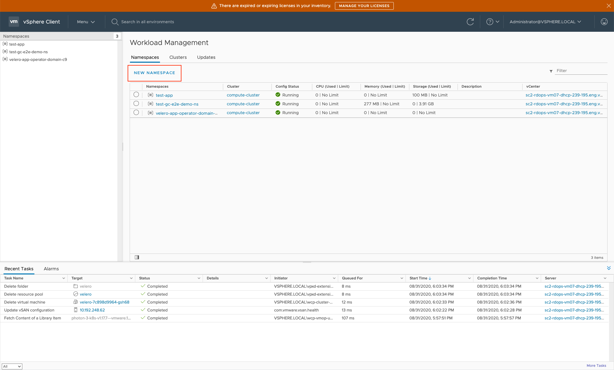
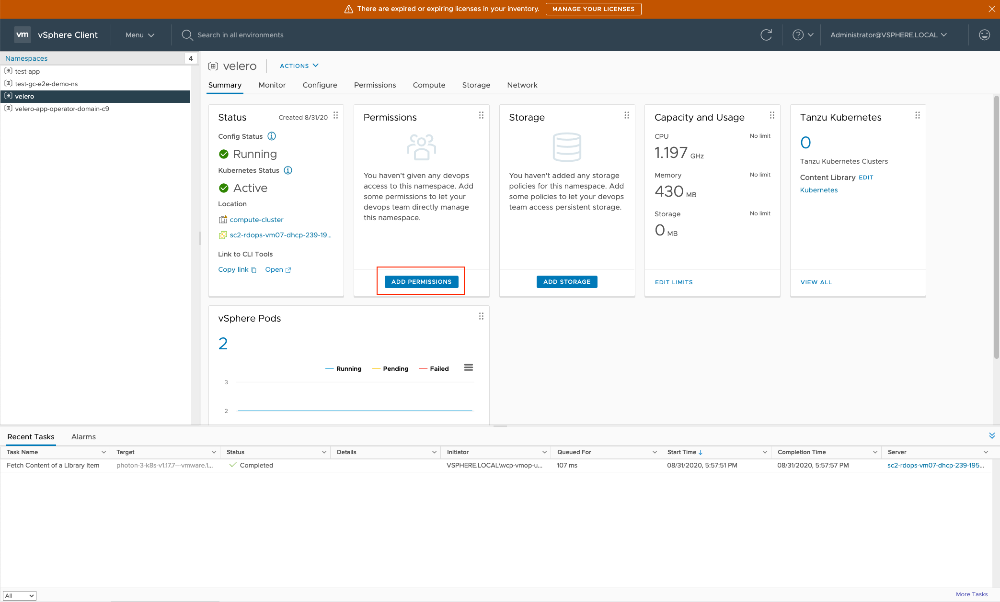
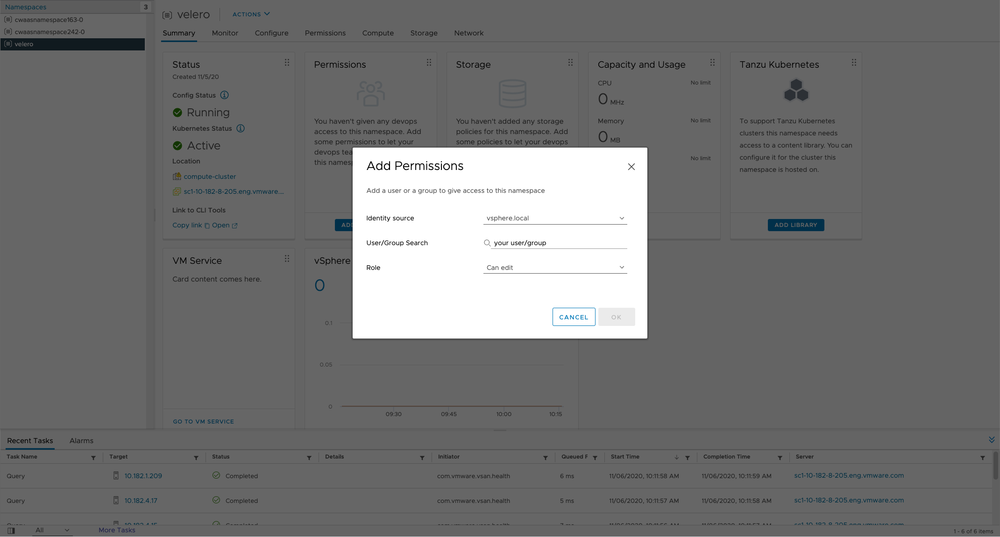

# User Workflow

Users here are expected to be vSphere users with access to:

* vSphere UI
* [Kubectl vSphere plugin](https://docs.vmware.com/en/VMware-vSphere/7.0/vmware-vsphere-with-tanzu/GUID-0F6E45C4-3CB1-4562-9370-686668519FCA.html)

## Installing Velero on Supervisor cluster

1. Enable `Velero vSphere Operator` Supervisor Service via vSphere UI. If you do not see any of the Supervisor Services as shown below, please double check the [compatibility](supervisor.md#compatibility) matrix.
    

2. Create a supervisor namespace for Velero instance via vSphere UI.
    

    And for user doesn't have VI Admin role, please add **EDIT** permission to the Supervisor namespace.
    

    Below is an example.
    

3. Create Velero vSphere Plugin Config

    The config map is used to specify that the plugin is being installed on `SUPERVISOR` cluster.

```bash
% cat <<EOF | kubectl -n <velero-namespace> apply -f -
apiVersion: v1
kind: ConfigMap
metadata:
  name: velero-vsphere-plugin-config
data:
  cluster_flavor: SUPERVISOR
EOF
```
     

4. Run [Velero vSphere Operator CLI](velero-vsphere-operator-cli.md), **velero-vsphere**, to install Velero into the same namespace created in step 2 above.
Assume users have logged in `kubectl vSphere plugin` as vSphere users.
Below are some examples about `velero-vsphere install` for different object stores as backup storage locations of Velero.

    **AWS S3**

    ```bash
    NAMESPACE="namespace of your choice"
    BUCKET="bucket of your choice"
    REGION="region of your choice, e.g., us-west-1"
    VSPHERE_PLUGIN=vsphereveleroplugin/velero-plugin-for-vsphere:1.1.0
 
    velero-vsphere install \
       --namespace $NAMESPACE \
       --version v1.5.1 \
       --provider aws \
       --plugins velero/velero-plugin-for-aws:v1.1.0,$VSPHERE_PLUGIN \
       --bucket $BUCKET \
       --secret-file ~/.aws/credentials \
       --snapshot-location-config region=$REGION \
       --backup-location-config region=$REGION
    ```

    **Minio**

    ```bash
    NAMESPACE="namespace of your choice"
    BUCKET="bucket of your choice"
    REGION=minio
    S3URL="minio url of your choice"
    VSPHERE_PLUGIN=vsphereveleroplugin/velero-plugin-for-vsphere:1.1.0
    
    velero-vsphere install \
        --namespace $NAMESPACE \
        --version v1.5.1 \
        --provider aws \
        --plugins velero/velero-plugin-for-aws:v1.1.0,$VSPHERE_PLUGIN \
        --bucket $BUCKET \
        --secret-file ~/.minio/credentials \
        --snapshot-location-config region=$REGION \
        --backup-location-config region=$REGION,s3ForcePathStyle="true",s3Url=$S3URL
    ```

    **Customized Object Store Plugin**

    ```bash
    NAMESPACE="namespace of your choice"
    VSPHERE_PLUGIN=vsphereveleroplugin/velero-plugin-for-vsphere:1.1.0
    
    velero-vsphere install \
        --namespace $NAMESPACE \
        --version v1.5.1 \
        --plugins $VSPHERE_PLUGIN \
        --no-secret \
        --use-volume-snapshots=false \
        --no-default-backup-location
    ```

## Uninstalling Velero on Supervisor cluster

1. Run [Velero vSphere Operator CLI](velero-vsphere-operator-cli.md) to uninstall velero.

    ```bash
    velero-vsphere uninstall -n "namespace where velero is installed"
    ```

2. Delete the supervisor namespace created for Velero instance via vSphere UI.
3. Disable `Velero vSphere Operator` supervisor service via vSphere UI.
